# Projeto de Introdução à Programação Paralela e Distribuída

## Integrantes

- João Henrique Botelho, 201154048
- João Vitor Figueredo, 201154072
- João Pedro Brum, 201152428

## Instruções

Para o projeto final, o grupo deve paralelizar uma aplicação utilizando algumas das linguagens estudadas ao longo da disciplina. Outras linguagens podem ser usadas, mas o entendimento do suporte ao paralelismo na linguagem escolhida é de responsabilidade do grupo.

## Projeto Escolhido: Diagrama de Voronoi

O Diagrama de Voronoi é uma decomposição espacial que divide um plano cartesiano em setores de Voronoi (ou células de Dirichlet), determinando as bordas de cada setor usando o bissetor dos pontos presentes em um conjunto.

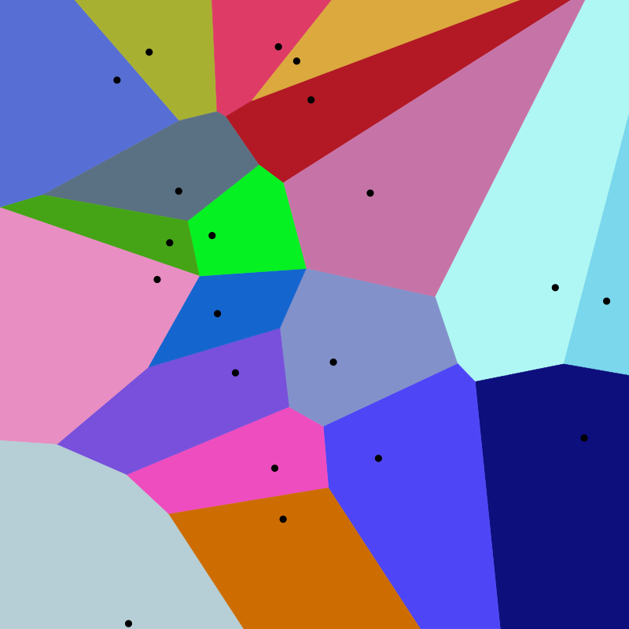

## Algoritmo

O algoritmo segue as etapas descritas abaixo. Primeiramente, define-se as bordas do plano cartesiano que englobam todos os pontos do conjunto.

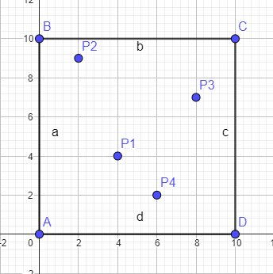

**(Considere P1 como P e P2 como Q)**

Em seguida, itera-se pelos n pontos do conjunto, onde, dado o ponto P, para cada ponto Q, realiza-se a seguinte rotina:

1. Inicialmente, define-se a borda do setor em P como a borda do plano cartesiano.

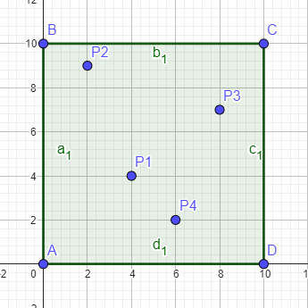

2. Calcula-se o bissetor de P e Q e determina-se os pontos de interseção (podem variar de 0 a 2) com as bordas do setor em P.

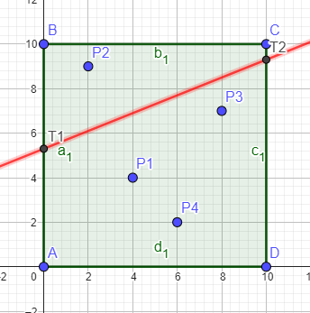

3. Removem-se os pontos que estiverem fora da parte do setor que contém o ponto P.

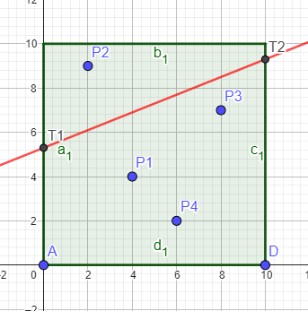

4. Define-se o novo setor.

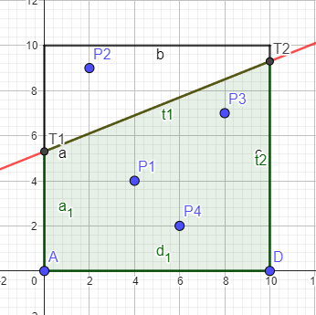

5. Repete-se esse processo com todos os demais pontos do conjunto.

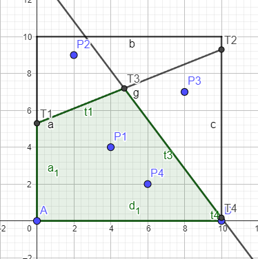

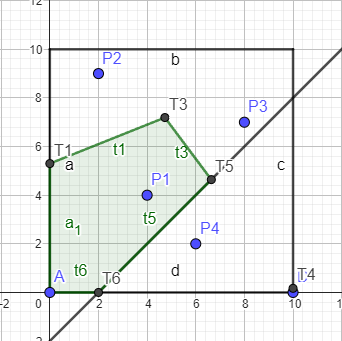

- Setor em P = (T6, A, T1, T3, T5)
- No final, adiciona-se o setor ao array de setores.

### Pseudocódigo

```pseudo
X_mn = valor x mínimo do conjunto
X_mx = valor x máximo do conjunto
Y_mn = valor y mínimo do conjunto
Y_mx = valor y máximo do conjunto

padding = valor para que nenhum ponto do conjunto caia na linha do limite do plano cartesiano

Box = {(X_mn + padding, Y_mn + padding), (X_mx + padding, Y_mn + padding), (X_mx + padding, Y_mx + padding), (X_mn + padding, Y_mx + padding)}

Para cada ponto P no conjunto faça:
    setor_p = Box
    Para cada ponto Q no conjunto faça:
        Bi = Bissetor(P, Q)
        Para cada borda b em setor_p faça:
            intersecao = interseção(Bi, b)
            Se houver interseção:
                setor_p.adicionar(intersecao)
                setor_p.remover(pontos_fora)
                setor_p = ordenar_sentido_anti-horário(P, setor_p)
    setores.adicionar(setor_p)
```

## Como Rodar

### Versão Sequencial

Para compilar e executar a versão sequencial:

```bash
g++ sequential.cpp -o sequential.exe
./sequential.exe
```

### Versão Paralela 1

Para compilar e executar a versão paralela 1 utilizando OpenMP:

```bash
g++ -fopenmp parallel_voronoi_1.cpp -o parallel_voronoi_1.exe
./parallel_voronoi_1.exe
```

### Versão Paralela 2

Para compilar e executar a versão paralela 2 utilizando OpenMP:

```bash
g++ -fopenmp parallel_voronoi_2.cpp -o parallel_voronoi_2.exe
./parallel_voronoi_2.exe
```

### Pré-requisito

- Ter o g++ e OpenMP instalados.

## Exemplo

### Input

```
//Cada par de valores representa um ponto
Point_set = {50, 100, 106, 49, 66, 175, 137, 197, 195, 147, 178, 73, 123, 123}
```

### Output

```v
Celula: 0
[0,149.873] [79.7716,132.855] [92.9764,90.9446] [10.1518,-0] [0,0]
Celula: 1
[92.9764,90.9446] [135.256,81.2317] [162.333,-0] [10.1518,-0]
Celula: 2
[0,200] [97.162,200] [108.283,164.109] [79.7716,132.855] [-0,149.873]
Celula: 3
[97.162,200] [190.138,200] [152.058,155.827] [108.283,164.109]
Celula: 4
[152.058,155.827] [190.138,200] [200,200] [200,106.899] [165.744,114.768]
Celula: 5
[135.256,81.2317] [165.744,114.768] [200,106.899] [200,0] [162.333,0]
Celula: 6
[79.7716,132.855] [108.283,164.109] [152.058,155.827] [165.744,114.768] [135.256,81.2317] [92.9764,90.9446]
```

### Demonstração Gráfica

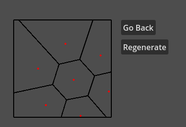

## Cálculos Complementares

### Bissetor

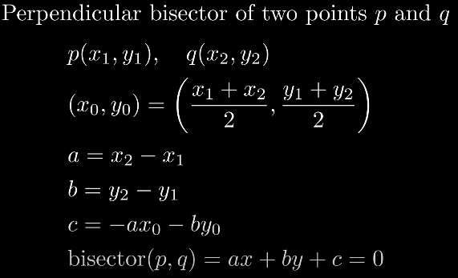

### Interseção

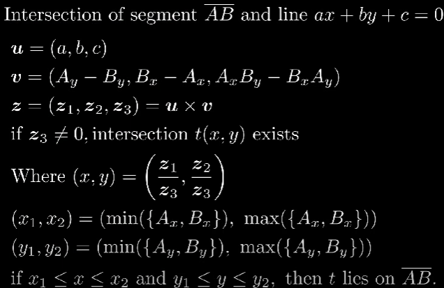

### Ângulo

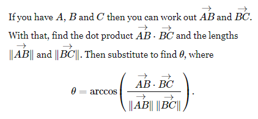

- B está no centro

## Resultados dos Códigos

> **Observação:** A versão paralela 1 refere-se ao código `parallel_voronoi_1.cpp` enquanto a versão paralela 2 refere-se ao código `parallel_voronoi_2.cpp`.

### Teste 1

Parâmetros: tamanho do plano = 1000, distância entre pontos = 50

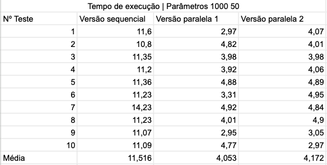
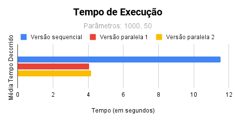

### Teste 2

Parâmetros: tamanho do plano = 1200, distância entre pontos = 50

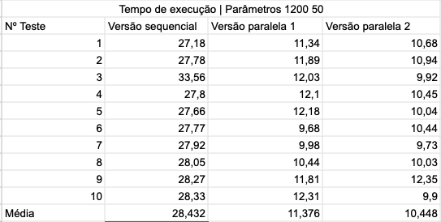
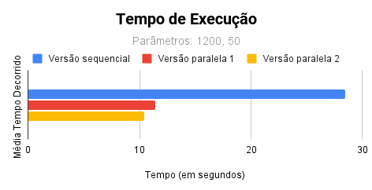

## Conclusão

Concluímos que ambas as abordagens são eficazes para paralelizar o algoritmo de Voronoi. As versões paralelas se mostraram duas vezes mais rápidas na execução, com tempo médio de 4 segundos no primeiro teste e 11 segundos no segundo teste, aproximadamente 64% mais rápidas que a versão sequencial.

A primeira alternativa de paralelização, apresentada no código `parallel_voronoi_1.cpp`, é preferível por não paralelizar as duas iterações presentes no algoritmo, como feito na segunda alternativa.

## Fontes

- [Vídeo explicativo](https://youtu.be/I6Fen2Ac-1U?si=YycZ3wpFmRtNuTD3)
- [Cálculo do Ângulo](https://math.stackexchange.com/questions/361412/finding-the-angle-between-three-points)
